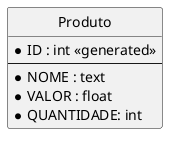

# Programação WEB

Esse modelo de aplicação se conecta ao https://remotemysql.com/. O usuário e senha ja estão no código e o modelo do banco de dados é esse da imagem abaixo:

Baixando esse repositório e abrindo no VSCode com o Docker instalado deve funcionar tudo corretamente.
